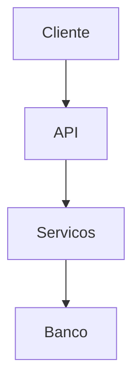

# Arquitetura

## Visao geral

[Descricao de alto nivel da arquitetura]

## Stack tecnologica

| Componente | Tecnologia | Justificativa |
|------------|-----------|---------------|
| Frontend   |            |               |
| Backend    |            |               |
| Banco      |            |               |
| Infra      |            |               |

## Diagrama

## Decisoes arquiteturais

| Decisao | Opcao escolhida | Alternativas | Justificativa |
|---------|----------------|-------------|---------------|
|         |                |             |               |
